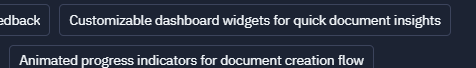
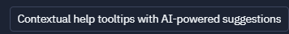

# UI Components Specifications

## Overview

This document provides detailed specifications for UI components to be included in the integrated system. These specifications ensure consistency across the IDE Project Starter and Documentation System integration while maintaining a cohesive user experience.

## Dashboard Widgets

### Document Insights Widget

#### Specifications

- **Purpose**: Display document completion status and insights at a glance
- **Dimensions**: 360px × 240px (responsive)
- **Layout**:
  - Header with title and action buttons
  - Circular progress indicator (80px diameter)
  - Key metrics in 2-column grid
  - Action button at bottom
- **Data Requirements**:
  - Document completion percentage
  - Document change statistics
  - Document activity metrics
- **Interactions**:
  - Click on header to expand/collapse detailed view
  - Click on metrics to navigate to detailed reports
  - Action button triggers document operations
- **States**:
  - Default: Collapsed view showing summary data
  - Expanded: Showing additional metrics and insights
  - Empty: Placeholder for new projects without documentation
  - Error: When metrics cannot be retrieved
- **Accessibility**:
  - ARIA labels for interactive elements
  - Color contrast ratio minimum 4.5:1
  - Keyboard navigation support
- **Integration Points**:
  - Connects to Documentation System metrics API
  - Updates in real-time when document changes occur
  - Filters based on Project Starter's active project

### Development Activity Widget

#### Specifications

- **Purpose**: Visualize development activity and documentation correlations
- **Dimensions**: 720px × 360px (responsive)
- **Layout**:
  - Header with title, period selector, and action buttons
  - Primary chart area (500px × 240px)
  - Legend below chart
  - Summary metrics in footer
- **Data Requirements**:
  - Code commit activity time series
  - Documentation update time series
  - Correlation metrics between development and documentation
- **Interactions**:
  - Time period selection (day, week, month, quarter)
  - Hover on data points to show detailed metrics
  - Click on chart segments to filter related documentation
  - Export data option in header menu
- **States**:
  - Loading: Animated placeholder while data loads
  - Populated: Showing visualization with data
  - Empty: Placeholder for new projects
  - Error: When activity data cannot be retrieved
- **Accessibility**:
  - Alternative text descriptions for charts
  - Keyboard-accessible data exploration
  - Screen reader announcements for data changes
  - High-contrast mode support
- **Integration Points**:
  - Pulls commit data from Project Starter's source control
  - Links documentation events from Documentation System
  - Supports filtering by document type or code module

## Animated Progress Indicators

### Documentation Flow Progress

#### Specifications

- **Purpose**: Visualize document creation progress through workflow stages
- **Dimensions**: Full width × 80px
- **Animation**:
  - Smooth transitions between stages (300ms, ease-in-out)
  - Pulse effect for current stage (subtle opacity change)
  - Color fill animation for completed stages
- **Stages**:
  1. Research collection
  2. Template selection
  3. Content generation
  4. Review and editing
  5. Publication and sharing
- **Interaction**:
  - Click on stages to view details or jump to that stage (if allowed)
  - Hover reveals stage description tooltip
  - Current stage clearly highlighted
- **States**:
  - Active: Current stage in progress
  - Completed: Stages that are finished
  - Locked: Future stages that cannot be accessed yet
  - Error: Stages that encountered issues
- **Accessibility**:
  - Progress announced to screen readers
  - Non-animation fallback for reduced motion preference
  - Keyboard navigation between stages
- **Integration Points**:
  - Driven by workflow state from Documentation System
  - Updated when Research Wizard progresses to new stages
  - Stores progress state for resuming sessions

### Research Completion Indicator

#### Specifications

- **Purpose**: Show research data completeness and quality
- **Dimensions**: 240px × 240px
- **Animation**:
  - Radial progress with smooth fill animation
  - Micro-interactions when data quality thresholds reached
  - Particle effects for completion celebration (subtle)
- **Data Visualization**:
  - Outer ring: Overall completion percentage
  - Inner segments: Individual research components
  - Center icon: Status indicator
- **Interaction**:
  - Click to expand detailed research quality report
  - Hover segments to see specific component status
  - Toggle between different research quality metrics
- **States**:
  - In Progress: Animated pulse showing active research
  - High Quality: Special highlighting for well-researched areas
  - Needs Attention: Visual indicators for areas needing more research
  - Complete: Celebration animation on completion
- **Accessibility**:
  - Numerical representation of progress available
  - Status updates announced to screen readers
  - Color not used as sole indicator of status
- **Integration Points**:
  - Pulls research quality metrics from Project Starter
  - Links to documentation templates based on research quality
  - Updates in real-time as research data changes

## Contextual Help Tooltips

### AI-Powered Suggestions Tooltip

#### Specifications

- **Purpose**: Provide intelligent suggestions based on context
- **Dimensions**: 320px max-width (height varies with content)
- **Trigger**:
  - Smart detection of user hesitation (3+ seconds of inactivity)
  - Question mark icon click in relevant sections
  - Keyboard shortcut (Alt+H)
- **Content**:
  - Title clearly indicating suggestion type
  - Concise suggestion text (max 2-3 sentences)
  - Examples or sample content when applicable
  - "Apply Suggestion" action button
- **Positioning**:
  - Smart placement avoiding obscuring relevant content
  - Arrow pointing to context element
  - Maintains visibility when scrolling
- **Animation**:
  - Fade in (200ms ease)
  - Subtle entrance motion (10px translation)
  - Highlighting of suggested changes
- **States**:
  - Initial: Basic contextual help
  - Loading: When fetching AI suggestions
  - With Suggestions: Showing actionable recommendations
  - Error: When suggestions cannot be generated
- **Accessibility**:
  - ARIA live regions for dynamic content
  - Keyboard dismissible
  - Focus management when suggestion applied
- **Integration Points**:
  - Uses Document System's template knowledge
  - Analyzes Research Wizard data for relevance
  - Connects to AI services for intelligent suggestions
  - Tracks applied suggestions for improvement

### Cross-System Context Tooltip

#### Specifications

- **Purpose**: Help users understand relationships between research and documentation
- **Dimensions**: 400px max-width (height varies with content)
- **Trigger**:
  - Connection icon click in interface
  - Automatic on first use of integrated features
  - Hover over integration indicators (1s delay)
- **Content**:
  - Visual relationship diagram
  - Explanation of data flow between systems
  - Impact of actions across systems
  - "Learn More" link to detailed documentation
- **Positioning**:
  - Centered on integration touchpoints
  - Multi-step tooltips for complex workflows
  - Dismissible with clear X button
- **Animation**:
  - Sequential highlighting of connected elements
  - Flow lines showing data movement
  - Pulse animation on key integration points
- **States**:
  - First-time: Extended explanation for new users
  - Reminder: Condensed version for returning users
  - Detailed: Expanded view with implementation details
  - Minimized: Icon-only mode for experienced users
- **Accessibility**:
  - Step-by-step keyboard accessible explanation
  - Alt descriptions for relationship diagrams
  - Progress indicator for multi-step explanations
- **Integration Points**:
  - Aware of user's history with both systems
  - Contextually relevant to current task
  - Adapts based on user role and permissions
  - Links directly to relevant documentation

## Implementation Guidelines

### Technical Requirements

- **Framework Compatibility**:
  - Components must work with React 18+
  - TypeScript type definitions required
  - Compatible with both systems' state management
- **Performance**:
  - Lazy-loading for complex visualizations
  - Efficient re-rendering (use memoization)
  - Animations optimized for 60fps
- **Responsiveness**:
  - All components must adapt to containers
  - Mobile-first design approach
  - Breakpoint consistency with existing systems

### Design System Integration

- **Typography**:
  - Use existing typography scale from Documentation System
  - Headings: Source Sans Pro (semi-bold)
  - Body: Source Sans Pro (regular)
  - Code: Fira Mono
- **Color Palette**:
  - Primary: #3498db (Documentation System blue)
  - Secondary: #2c3e50 (IDE Project Starter dark blue)
  - Accent: #e74c3c (for attention indicators)
  - Use existing color variables from both systems
- **Spacing**:
  - Follow 8px grid system
  - Consistent padding (16px for containers, 8px for related elements)
  - Maintain component density matching existing systems

### Accessibility Requirements

- **Compliance Standards**:
  - WCAG 2.1 AA compliance required
  - WAI-ARIA 1.1 pattern implementation
- **Testing Requirements**:
  - Screen reader testing (NVDA, VoiceOver)
  - Keyboard navigation verification
  - Color contrast verification
- **Specific Considerations**:
  - Animation must respect reduced motion preferences
  - Interactive elements must have appropriate focus states
  - Status changes must be announced to screen readers

## Component Development Process

1. **Design Review**:
   - Component designs must be reviewed against these specifications
   - Variations and states must be defined before implementation

2. **Implementation**:
   - Start with accessibility-first approach
   - Implement core functionality before animations
   - Create comprehensive Storybook stories for all states

3. **Testing**:
   - Unit tests for component logic
   - Integration tests for system interactions
   - Accessibility testing with automated tools and manual verification

4. **Documentation**:
   - Create component API documentation
   - Include example usage code
   - Document integration points with both systems

## Next Steps

- Develop component prototypes for initial review
- Create shared component library repository
- Establish component governance process
- Implement highest priority components first:
  1. Document Insights Widget
  2. Documentation Flow Progress
  3. Cross-System Context Tooltip