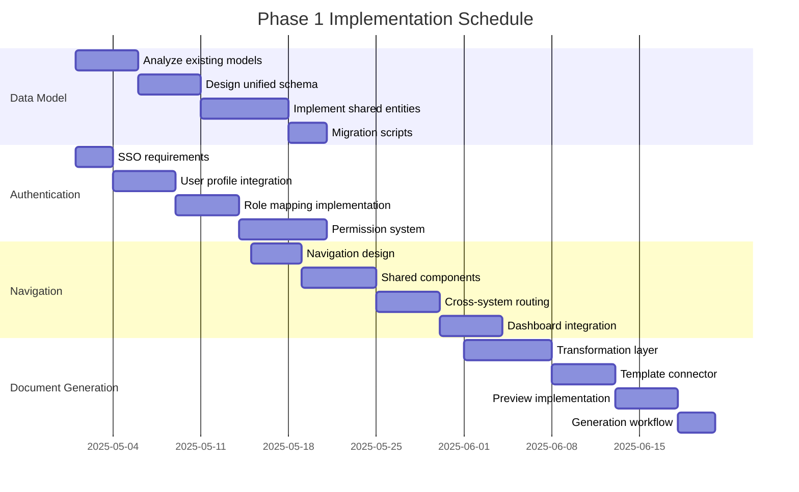
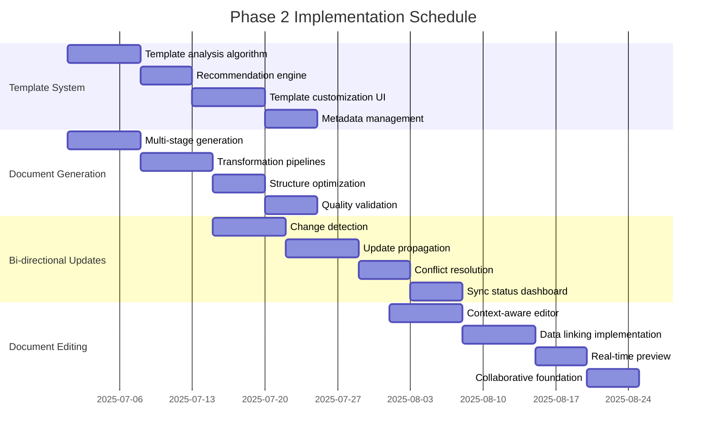
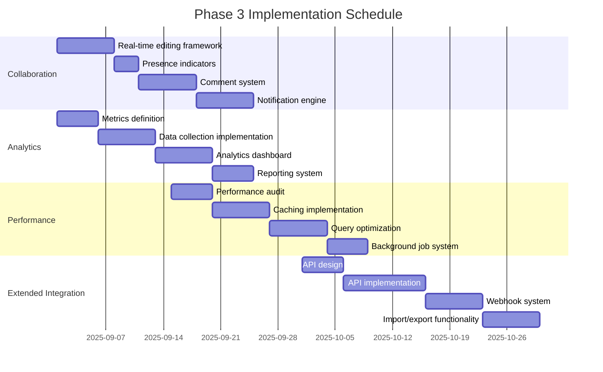

# Development Roadmap

## Overview

This document outlines the phased implementation approach for integrating the IDE Project Starter with the Documentation System. It defines priority features, development milestones, testing strategies, and deployment considerations to ensure a smooth, incremental integration process.

## Strategic Goals

The integration roadmap is designed to achieve the following strategic goals:

1. **Seamless User Experience**: Create a unified experience that feels like a single, cohesive application
2. **Incremental Value Delivery**: Deliver valuable integration features early and frequently
3. **Minimal Disruption**: Ensure existing functionality remains available throughout the integration
4. **Quality Assurance**: Maintain high quality standards through comprehensive testing
5. **Future Extensibility**: Create a foundation that supports future enhancements and extensions

## Phased Implementation Approach

### Phase 1: Foundation (Months 1-2)

The first phase establishes the technical foundation for integration and delivers initial integration features.

#### Phase 1 Milestones

| Milestone | Description | Timeline |
|-----------|-------------|----------|
| 1.1 | Unified data model implementation | Week 1-2 |
| 1.2 | Cross-system navigation framework | Week 3-4 |
| 1.3 | Authentication integration | Week 5-6 |
| 1.4 | Basic research-to-documentation linking | Week 7-8 |

#### Phase 1 Features

##### 1. Unified Data Model
- Shared project entity structure
- Cross-system reference architecture
- Data validation framework
- Initial database schema migration

##### 2. Authentication and User Management
- Single sign-on implementation
- Unified user profiles
- Role-based access control
- Permission synchronization

##### 3. Basic Navigation Integration
- Cross-system navigation bar
- Shared breadcrumb implementation
- Contextual linking between systems
- Unified dashboard with data from both systems

##### 4. Simple Document Generation
- Basic research-to-document transformation
- Initial template selection
- Minimal documentation preview
- Manual document generation from research

#### Phase 1 Technical Tasks

### Phase 2: Core Integration (Months 3-4)

The second phase implements the core integration features that demonstrate the full value of the integrated system.

#### Phase 2 Milestones

| Milestone | Description | Timeline |
|-----------|-------------|----------|
| 2.1 | Advanced template selection system | Week 9-10 |
| 2.2 | Intelligent document generation | Week 11-12 |
| 2.3 | Bi-directional data flow | Week 13-14 |
| 2.4 | Document preview and editing | Week 15-16 |

#### Phase 2 Features

##### 1. Advanced Template System
- Template recommendation engine
- Template customization interface
- Template metadata management
- Conditional content blocks

##### 2. Research-Driven Document Generation
- Multi-stage document generation
- Research data transformation pipelines
- Document structure optimization
- Content quality validation

##### 3. Bi-directional Updates
- Change detection between systems
- Update propagation framework
- Conflict resolution system
- Synchronization status tracking

##### 4. Integrated Document Editing
- Context-aware document editor
- Research data linking in editor
- Real-time preview updates
- Collaborative editing foundation

#### Phase 2 Technical Tasks

### Phase 3: Enhanced Integration (Months 5-6)

The third phase enhances the integrated experience with advanced features and optimizations.

#### Phase 3 Milestones

| Milestone | Description | Timeline |
|-----------|-------------|----------|
| 3.1 | Real-time collaboration features | Week 17-18 |
| 3.2 | Advanced analytics and insights | Week 19-20 |
| 3.3 | Performance optimization | Week 21-22 |
| 3.4 | Extended API and integration points | Week 23-24 |

#### Phase 3 Features

##### 1. Collaborative Features
- Real-time editing with presence
- Comment and feedback system
- Change tracking and approval
- Notification system

##### 2. Analytics and Insights
- Documentation quality metrics
- Research completeness analytics
- User activity dashboards
- System usage reporting

##### 3. Performance Optimization
- Caching strategy implementation
- Query optimization
- Lazy loading for large documents
- Background processing for intensive tasks

##### 4. Extended Integration Capabilities
- Public API for third-party integration
- Webhook system for external events
- Export formats and integrations
- Import capabilities from external systems

#### Phase 3 Technical Tasks

## Priority Features for Initial Integration

The following features are prioritized for early implementation to provide immediate value:

### 1. Project Synchronization
- Single source of truth for project metadata
- Automatic project creation across systems
- Project status synchronization
- Project listing in unified dashboard

### 2. Research to Documentation Flow
- Basic document generation from research data
- Manual triggering of document creation
- Simple template selection
- Research completion notifications

### 3. Unified Navigation
- Cross-system navigation bar
- Contextual navigation between related items
- Shared project selector
- Recent items across both systems

### 4. Shared Authentication
- Single sign-on experience
- Consistent user profiles
- Basic role-based access control
- Session management

## Testing Strategy

The integration will be verified through a comprehensive testing approach:

### Test Categories

#### 1. Unit Tests
- Individual component functionality
- Service implementations
- Utility functions
- Data transformations

#### 2. Integration Tests
- Cross-component interactions
- API endpoint functionality
- Database operations
- Event processing

#### 3. End-to-End Tests
- Complete user workflows
- Cross-system interactions
- UI functionality
- Authentication flows

#### 4. Performance Tests
- Response time benchmarks
- Throughput measurements
- Resource utilization
- Scalability verification

#### 5. Security Tests
- Authentication mechanisms
- Authorization controls
- Data protection
- API security

### Test Implementation Approach

#### Automated Testing
- Jest for JavaScript/TypeScript unit tests
- React Testing Library for component tests
- Cypress for end-to-end tests
- JMeter for performance testing
- OWASP ZAP for security scanning

#### Test Coverage Requirements
- Minimum 85% unit test coverage
- Critical paths covered by integration tests
- All user flows covered by end-to-end tests
- Key performance scenarios benchmarked

#### Continuous Integration
- Tests run on every pull request
- Daily full test suite execution
- Weekly performance test runs
- Monthly security scans

### Acceptance Criteria

Each feature must meet the following acceptance criteria before release:

1. All automated tests pass
2. Performance meets defined benchmarks
3. Accessibility requirements satisfied
4. Security review completed
5. Documentation updated

## Deployment Considerations

### Deployment Strategy

#### 1. Infrastructure Requirements
- Kubernetes cluster for container orchestration
- PostgreSQL database for structured data
- Redis for caching and real-time features
- S3-compatible storage for document assets
- CDN for static content delivery

#### 2. Deployment Environments
- Development - For active development work
- Staging - For integration testing and QA
- Production - For end-user access
- Demo - For showcasing features to stakeholders

#### 3. Feature Flagging
- Implement feature flags for gradual rollout
- Configure environment-specific flag settings
- Create flag configuration dashboard
- Establish flag lifecycle management

#### 4. Rollout Strategy
- Blue-green deployment for zero downtime
- Canary releases for high-risk features
- A/B testing capability for UI changes
- Automated rollback procedures

### Monitoring and Observability

#### 1. Application Monitoring
- Request tracing across services
- Error tracking and alerting
- Performance metrics collection
- User experience monitoring

#### 2. Infrastructure Monitoring
- Resource utilization tracking
- Cluster health monitoring
- Database performance metrics
- Network traffic analysis

#### 3. Business Metrics
- System usage statistics
- Feature adoption tracking
- User engagement metrics
- Error rate by feature

#### 4. Alerting Strategy
- Critical error immediate alerts
- Performance degradation warnings
- Unusual usage pattern notifications
- Security incident alerts

## Risk Management

### Identified Risks and Mitigation Strategies

#### 1. Integration Complexity
- **Risk**: Integration complexity exceeds estimates
- **Impact**: Schedule delays, reduced feature set
- **Probability**: Medium
- **Mitigation**: Phase implementation, prioritize core features, maintain separate systems in parallel until integration is stable

#### 2. Data Model Incompatibility
- **Risk**: Fundamental data model differences complicate integration
- **Impact**: Compromised data integrity, complex synchronization
- **Probability**: Medium
- **Mitigation**: Comprehensive data model analysis early, adapter pattern implementation, clear migration plan

#### 3. Performance Degradation
- **Risk**: Integration causes performance issues
- **Impact**: Poor user experience, reduced adoption
- **Probability**: Medium
- **Mitigation**: Performance testing throughout development, optimization phase, scalable architecture design

#### 4. User Adoption Resistance
- **Risk**: Users resist workflow changes
- **Impact**: Reduced productivity, negative feedback
- **Probability**: Medium
- **Mitigation**: User involvement in design, comprehensive training, phased rollout, feedback mechanisms

#### 5. Security Vulnerabilities
- **Risk**: Integration introduces security issues
- **Impact**: Data breaches, compliance violations
- **Probability**: Low
- **Mitigation**: Security review at each phase, penetration testing, compliance validation

## Maintenance and Support Plan

### Ongoing Maintenance

#### 1. Regular Updates
- Bi-weekly patch releases for bug fixes
- Monthly minor releases for enhancements
- Quarterly major releases for significant features
- Emergency hotfixes as needed

#### The following topics were out of scope for this document:
- Pricing and business model considerations
- Content migration guidance
- Data backup and disaster recovery policies