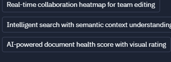

# Feature Integration Map

## Overview

This document maps the integration points between the IDE Project Starter and Documentation System features. It identifies how features from both systems connect and interact to create a unified workflow and seamless user experience.

## Core Feature Integrations

### 1. Research-to-Documentation Pipeline

#### IDE Project Starter Features
- Research Wizard
- Project Metadata Collection
- Template Recommendation Engine
- Source Material Management

#### Documentation System Features
- Document Template Library
- Content Generation Framework
- Document Structure Management
- Version Control System

#### Integration Approach
```
┌───────────────────────┐                  ┌───────────────────────┐
│  IDE Project Starter  │                  │  Documentation System │
│                       │                  │                       │
│  ┌─────────────────┐  │                  │  ┌─────────────────┐  │
│  │ Research Wizard │──┼──────────────────┼─►│ Template Library│  │
│  └─────────────────┘  │                  │  └─────────────────┘  │
│          │            │                  │          │            │
│          ▼            │                  │          ▼            │
│  ┌─────────────────┐  │                  │  ┌─────────────────┐  │
│  │ Research Data   │──┼──────────────────┼─►│ Content Gen     │  │
│  └─────────────────┘  │                  │  └─────────────────┘  │
│          │            │                  │          │            │
│          ▼            │                  │          ▼            │
│  ┌─────────────────┐  │                  │  ┌─────────────────┐  │
│  │ Project Config  │◄─┼──────────────────┼─►│ Doc Structure   │  │
│  └─────────────────┘  │                  │  └─────────────────┘  │
│                       │                  │                       │
└───────────────────────┘                  └───────────────────────┘
```

#### Integration Touchpoints
1. **Template Selection**: Research type and gathered data inform document template selection
2. **Content Population**: Research data automatically populates relevant document sections
3. **Structure Alignment**: Document structure adapts based on research completeness
4. **Metadata Synchronization**: Project metadata remains consistent across systems

### 2. Collaborative Features Integration



#### IDE Project Starter Features
- Team Project Management
- Code Version Control Integration
- Multiple Editor Sessions
- Search Functionality

#### Documentation System Features
- Document Collaboration
- Document Health Metrics
- Advanced Document Search
- Content Quality Analysis

#### Integration Approach
```
┌───────────────────────┐                  ┌───────────────────────┐
│  IDE Project Starter  │                  │  Documentation System │
│                       │                  │                       │
│  ┌─────────────────┐  │                  │  ┌─────────────────┐  │
│  │ Team Management │◄─┼──────────────────┼─►│ User Presence   │  │
│  └─────────────────┘  │                  │  └─────────────────┘  │
│          │            │                  │          │            │
│          ▼            │                  │          ▼            │
│  ┌─────────────────┐  │                  │  ┌─────────────────┐  │
│  │ Editor Sessions │◄─┼──────────────────┼─►│ Collab Heatmap  │  │
│  └─────────────────┘  │                  │  └─────────────────┘  │
│          │            │                  │          │            │
│          ▼            │                  │          ▼            │
│  ┌─────────────────┐  │                  │  ┌─────────────────┐  │
│  │ Project Search  │◄─┼──────────────────┼─►│ Semantic Search │  │
│  └─────────────────┘  │                  │  └─────────────────┘  │
│          │            │                  │          │            │
│          ▼            │                  │          ▼            │
│  ┌─────────────────┐  │                  │  ┌─────────────────┐  │
│  │ Code Quality    │◄─┼──────────────────┼─►│ Document Health │  │
│  └─────────────────┘  │                  │  └─────────────────┘  │
│                       │                  │                       │
└───────────────────────┘                  └───────────────────────┘
```

#### Integration Touchpoints
1. **Real-time Collaboration Heatmap**
   - Shows active editors across both code and documentation
   - Visualizes activity hotspots in real-time
   - Enables awareness of team focus areas
   - Integrates presence data from both systems

2. **Intelligent Search with Semantic Context**
   - Unified search across code and documentation
   - Understands relationships between code and documentation
   - Provides contextually relevant results
   - Preserves relationship links in search results

3. **AI-powered Document Health Score**
   - Analyzes documentation completeness relative to code
   - Visual rating system for documentation quality
   - Suggests improvements based on code complexity
   - Tracks documentation health over time

4. **Integrated Visual Changelog with Storytelling Elements**
   - Combines code and documentation changes into visual narratives
   - Provides contextual explanations for project evolution
   - Enables collaborative storytelling around project changes
   - Visualizes relationships between code and documentation changes

### 3. User Interface Integration

#### IDE Project Starter Features
- Project Dashboard
- Navigation System
- Progress Tracking
- Notification Framework

#### Documentation System Features
- Document Browser
- Template Gallery
- Document Status Indicators
- Workflow Management

#### Integration Approach
```
┌───────────────────────┐                  ┌───────────────────────┐
│  IDE Project Starter  │                  │  Documentation System │
│                       │                  │                       │
│  ┌─────────────────┐  │  ┌───────────┐   │  ┌─────────────────┐  │
│  │ Project         │◄─┼─►│ Unified   │◄──┼─►│ Document        │  │
│  │ Dashboard       │  │  │ Navigation│   │  │ Browser         │  │
│  └─────────────────┘  │  └───────────┘   │  └─────────────────┘  │
│          │            │                  │          │            │
│          ▼            │  ┌───────────┐   │          ▼            │
│  ┌─────────────────┐  │  │Integrated │   │  ┌─────────────────┐  │
│  │ Progress        │◄─┼─►│Progress   │◄──┼─►│ Document Status │  │
│  │ Tracking        │  │  │Indicators │   │  │ Indicators      │  │
│  └─────────────────┘  │  └───────────┘   │  └─────────────────┘  │
│          │            │                  │          │            │
│          ▼            │  ┌───────────┐   │          ▼            │
│  ┌─────────────────┐  │  │Shared     │   │  ┌─────────────────┐  │
│  │ Notification    │◄─┼─►│Event      │◄──┼─►│ Workflow        │  │
│  │ Center          │  │  │System     │   │  │ Management      │  │
│  └─────────────────┘  │  └───────────┘   │  └─────────────────┘  │
│                       │                  │                       │
└───────────────────────┘                  └───────────────────────┘
```

#### Integration Touchpoints
1. **Unified Navigation**: Seamless movement between research and documentation contexts
2. **Integrated Progress Tracking**: Visualize completion across research and documentation
3. **Shared Notification System**: Alerts for events in either system
4. **Contextual Help System**: Dynamic guidance based on current context

### 4. Data Integration Layer

#### IDE Project Starter Data
- Project Configuration
- Research Data
- User Preferences
- Activity History

#### Documentation System Data
- Document Content
- Template Library
- Version History
- User Annotations

#### Integration Approach
```
┌─────────────────────────────────────────────────────────────────┐
│                      Integration Data Layer                     │
├─────────────────────────────────────────────────────────────────┤
│                                                                 │
│  ┌─────────────────┐            ┌─────────────────┐             │
│  │ Shared Project  │◄─────────►│  Shared User    │             │
│  │ Repository      │            │  Repository     │             │
│  └─────────────────┘            └─────────────────┘             │
│          ▲                                ▲                     │
│          │                                │                     │
│          ▼                                ▼                     │
│  ┌─────────────────┐            ┌─────────────────┐             │
│  │ Research-Doc    │◄─────────►│  Event          │             │
│  │ Mapping         │            │  Stream         │             │
│  └─────────────────┘            └─────────────────┘             │
│          ▲                                ▲                     │
│          │                                │                     │
│          ▼                                ▼                     │
│  ┌─────────────────┐            ┌─────────────────┐             │
│  │ Content         │◄─────────►│  Analytics      │             │
│  │ Registry        │            │  Store          │             │
│  └─────────────────┘            └─────────────────┘             │
│                                                                 │
└─────────────────────────────────────────────────────────────────┘
        ▲                                      ▲
        │                                      │
        ▼                                      ▼
┌───────────────────────┐            ┌───────────────────────┐
│  IDE Project Starter  │            │  Documentation System │
│  Data Layer           │            │  Data Layer           │
└───────────────────────┘            └───────────────────────┘
```

#### Integration Touchpoints
1. **Shared Project Repository**: Single source of truth for project metadata
2. **Research-Doc Mapping**: Links between research data and document sections
3. **Event Stream**: Real-time updates for changes in either system
4. **Content Registry**: Manages relationships between different content types
5. **Analytics Store**: Unified metrics for project progress and health

## Feature-Specific Integration Details

### Real-time Collaboration Heatmap

#### Purpose
Enable teams to see where active editing is occurring across both research and documentation, promoting awareness and coordination.

#### Technical Integration
- **Data Sources**:
  - IDE cursor positions and edit events
  - Documentation system editing sessions
  - User presence information
  
- **Processing Layer**:
  - Coordinates normalization between different document types
  - Aggregate activity analytics
  - Time-windowed activity calculations
  
- **Visualization Layer**:
  - Color-coded heatmap overlay for documents
  - User avatar positioning
  - Activity intensity indicators
  
- **Integration Touchpoints**:
  - WebSocket connections for real-time updates
  - Shared user session management
  - Coordinate mapping service between systems

#### User Experience
- Consistent visualization style across code and documentation
- Single toggle control to enable/disable heatmap in either context
- User filtering options applied consistently
- Click-to-navigate to active areas in either system

### Intelligent Search with Semantic Context

#### Purpose
Provide unified search capabilities that understand the relationships between research data and documentation to deliver contextually relevant results.

#### Technical Integration
- **Data Sources**:
  - IDE Project code and comments
  - Research data and notes
  - Documentation content and metadata
  - Cross-reference mappings
  
- **Processing Layer**:
  - Semantic indexing of all content
  - Relationship graph between research and documentation
  - Context-aware query processing
  - Relevance scoring algorithm
  
- **Results Layer**:
  - Unified result presentation
  - Context highlighting
  - Related content suggestions
  - Action links appropriate to content type
  
- **Integration Touchpoints**:
  - Shared search index
  - Cross-system content crawler
  - Query distribution service
  - Result aggregation service

#### User Experience
- Single search interface accessible from both systems
- Results clearly indicate source system
- Preview capabilities for both code and documentation
- Filters that work consistently across content types

### AI-powered Document Health Score

#### Purpose
Provide objective measurement of documentation quality and completeness relative to the code and research it describes.

#### Technical Integration
- **Data Sources**:
  - Code complexity metrics
  - Research completeness indicators
  - Documentation coverage analysis
  - Historical quality trends
  
- **Analysis Layer**:
  - Documentation-to-code coverage mapping
  - Readability assessment
  - Completeness evaluation
  - Technical accuracy verification
  
- **Reporting Layer**:
  - Visual health score display
  - Trend visualization
  - Improvement recommendations
  - Comparative benchmarks
  
- **Integration Touchpoints**:
  - Shared scoring service
  - Cross-system analytics aggregator
  - Recommendation engine
  - History tracking service

#### User Experience
- Consistent scoring visualization in both systems
- Actionable improvement suggestions
- Historical tracking of documentation health
- Drill-down capabilities to specific improvement areas

## Integration Dependencies

The following diagram shows the dependencies between different integration features:

```
┌─────────────────────┐
│ Shared Authentication│◄────┐
└────────────┬────────┘     │
             │              │
             ▼              │
┌─────────────────────┐     │
│ Shared Project Data │◄────┼────────────────┐
└────────────┬────────┘     │                │
             │              │                │
             ▼              │                │
┌─────────────────────┐     │                │
│ Cross-system Events │◄────┼────┐           │
└────────────┬────────┘     │    │           │
             │              │    │           │
             ▼              │    │           │
┌─────────────────────┐     │    │           │
│ Unified Navigation  │◄────┘    │           │
└────────────┬────────┘          │           │
             │                    │           │
             ▼                    │           │
┌─────────────────────┐          │           │
│ Research-Doc Linking│◄─────────┘           │
└────────────┬────────┘                      │
             │                                │
             ▼                                │
┌─────────────────────┐                      │
│ Real-time Collab    │◄─────────────────────┘
└────────────┬────────┘
             │
             ▼
┌─────────────────────┐
│ Intelligent Search  │
└────────────┬────────┘
             │
             ▼
┌─────────────────────┐
│ Document Health Score│
└────────────┬────────┘
             │
             ▼
┌─────────────────────┐
│ Visual Changelog    │
└─────────────────────┘
```

## Implementation Sequencing

The integration features should be implemented in the following order:

1. **Foundation Layer**
   - Shared Authentication
   - Shared Project Data
   - Cross-system Events

2. **Core Integration**
   - Unified Navigation
   - Research-Doc Linking
   - Basic Progress Tracking

3. **Enhanced Features**
   - Real-time Collaboration Heatmap
   - Intelligent Search with Semantic Context
   - Document Health Score
   - Integrated Visual Changelog

4. **Advanced Capabilities**
   - AI-powered Suggestions
   - Predictive Documentation Needs
   - Cross-reference Optimization

## Success Criteria

For each feature integration, the following criteria define success:

1. **Data Consistency**: Information remains consistent between systems
2. **Performance Impact**: Integration adds no more than 10% overhead
3. **User Experience**: Users can navigate between contexts without friction
4. **Feature Completeness**: All defined integration points are functional
5. **Error Resilience**: Failure in one system doesn't compromise the other

## Next Steps

1. Conduct technical feasibility assessment for each integration point
2. Develop proof-of-concept for highest priority integrations
3. Create detailed technical specifications for each integration feature
4. Establish integration testing framework
5. Implement foundation layer components